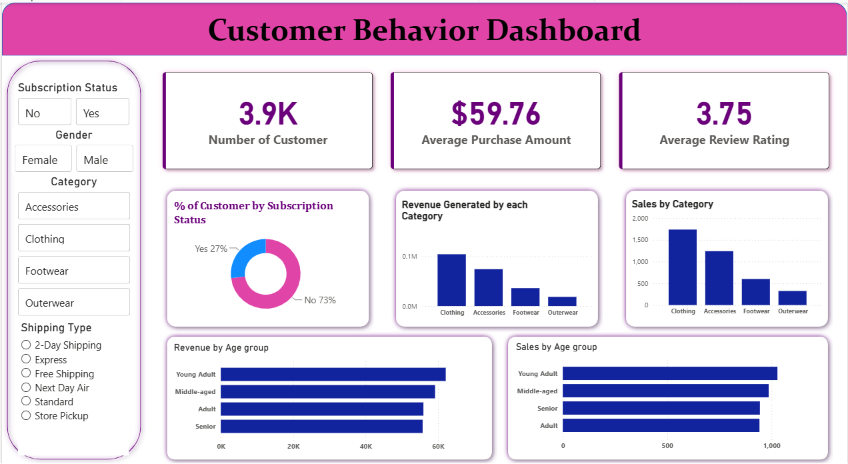

# 🛍️ Customer Purchase Analysis

## 📌 Project Overview

This project presents an end-to-end Data Analytics workflow using **Python, MySQL, and Power BI** to analyze customer shopping behavior. The objective is to transform raw transactional data into meaningful business insights that support data-driven decision-making.

The project follows the complete analytics lifecycle:

**Data Cleaning (Python) → Business Analysis (MySQL) → Interactive Dashboard (Power BI)**

---

# 🎯 Business Problem

Retail businesses collect large volumes of customer transaction data every day. However, without proper analysis, valuable insights into customer behavior, purchasing patterns, product performance, and subscription trends remain hidden.

This project aims to analyze customer purchase data to identify trends, evaluate customer segments, measure revenue performance, and build an interactive dashboard that supports business decisions.

---

# 🎯 Project Objectives

- Clean and prepare raw customer purchase data.
- Perform exploratory data analysis (EDA).
- Analyze customer purchasing behavior.
- Compare revenue across customer demographics.
- Evaluate subscription and discount patterns.
- Identify top-performing products and categories.
- Segment customers based on purchase history.
- Build an interactive Power BI dashboard for business reporting.

---

# 📂 Dataset Information

The dataset contains customer shopping transactions, including:

- Customer Demographics
- Product Categories
- Purchase Amount
- Review Ratings
- Subscription Status
- Shipping Type
- Discount Information
- Previous Purchases
- Payment Methods

---

# 🛠️ Tech Stack

| Tool | Purpose |
|------|----------|
| Python | Data Cleaning & Feature Engineering |
| Pandas | Data Manipulation |
| NumPy | Numerical Operations |
| MySQL | Business Querying |
| Power BI | Dashboard & Visualization |

---

# 🔄 Project Workflow

```
Raw Dataset
      │
      ▼
Python
(Data Cleaning & Feature Engineering)
      │
      ▼
MySQL
(Business Analysis)
      │
      ▼
Power BI
(Interactive Dashboard)
```

---

# 🐍 Phase 1 – Python

### Data Cleaning

- Loaded customer purchase dataset
- Inspected data structure
- Removed inconsistencies
- Standardized column names
- Handled missing values

### Feature Engineering

Created additional columns including:

- Age Group
- Purchase Frequency (Days)

### Exploratory Data Analysis

- Statistical Summary
- Customer Demographics
- Purchase Behaviour
- Revenue Analysis
- Product Analysis

---

# 🗄️ Phase 2 – MySQL

The cleaned dataset was imported into MySQL for business analysis.

## Business Questions Answered

### Customer Analytics

- Revenue generated by Male vs Female customers
- Customers spending above average after discounts
- Members spending above average purchase amount

### Product Analytics

- Top 10 highest-rated products
- Top 3 purchased products in each category
- Products with the highest discount usage

### Sales Analytics

- Average purchase amount by shipping type
- Revenue contribution by age group
- Revenue comparison between subscribers and non-subscribers

### Customer Behaviour

- Customer segmentation (New, Returning, Loyal)
- Repeat buyer subscription analysis

### SQL Concepts Used

- Aggregate Functions
- GROUP BY
- CASE Statements
- Subqueries
- Common Table Expressions (CTEs)
- Window Functions (ROW_NUMBER)

---

# 📊 Power BI Dashboard

## KPI Cards

- 👥 Total Customers
- 💰 Average Purchase Amount
- ⭐ Average Review Rating
- 📌 Subscription Rate (%)

## Visualizations

- Revenue by Category
- Sales by Category
- Revenue by Age Group
- Sales by Age Group

## Interactive Slicers

- Subscription Status
- Gender
- Category
- Shipping Type

---

# 📸 Dashboard Preview

> Replace the image below with your Power BI dashboard screenshot.



---

# 💡 Key Business Insights

- Compared revenue generated by male and female customers.
- Evaluated spending behaviour of subscribed and non-subscribed customers.
- Identified the highest-rated and most frequently purchased products.
- Analyzed revenue contribution across different age groups.
- Examined customer loyalty using previous purchase history.
- Measured the impact of discounts on purchasing behaviour.
- Compared purchase amounts across shipping methods.

---

# 📈 Business Recommendations

- Improve promotional campaigns for products with high customer ratings.
- Encourage repeat customers to subscribe through loyalty programs.
- Optimize discount strategies for products with lower sales.
- Focus marketing efforts on high-revenue customer segments.
- Monitor category performance regularly using interactive dashboards.

---

# 📁 Project Structure

```
Customer_purchase_analysis/

│
├── customer_purchase_analysis.ipynb
├── customer_analysis.sql
├── Customer_Purchase_Dashboard.pbix
├── dashboard.png
├── README.md
```

---

# 🚀 Skills Demonstrated

- Data Cleaning
- Feature Engineering
- Exploratory Data Analysis (EDA)
- SQL Query Writing
- Customer Segmentation
- Business Analytics
- Dashboard Development
- Data Visualization
- Data Storytelling

---

# 👨‍💻 Author

**Alwin Santhosh**

Aspiring Data Analyst

GitHub: https://github.com/AlwinSanthosh03

---

⭐ If you found this project useful, consider giving it a star!
